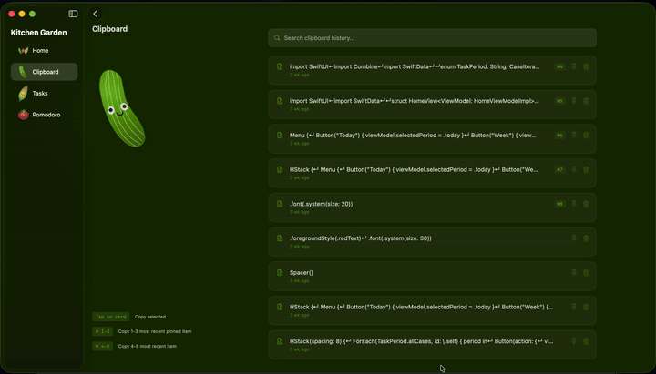
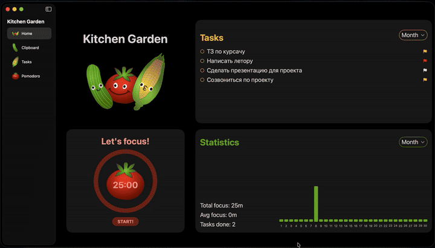
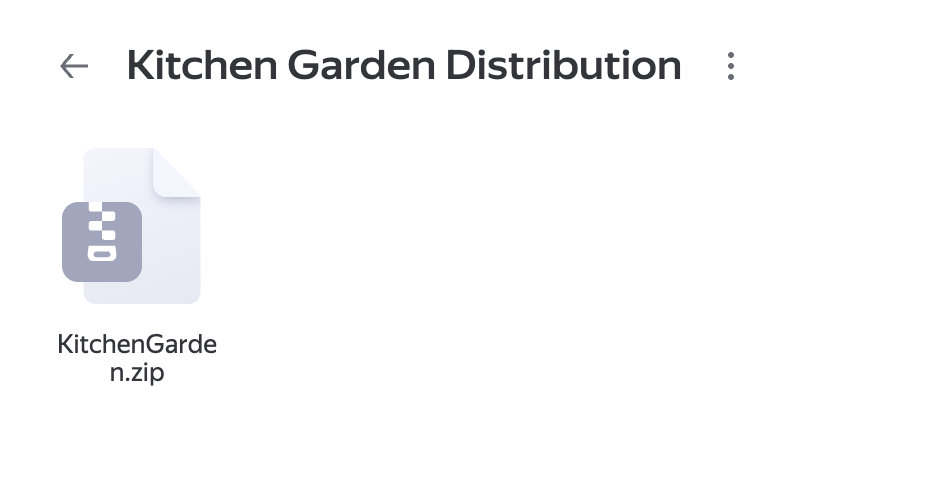

<p align="center">
  
</p>
Kitchen Garden – сад продуктивности на твоем Mac — овощи знают, что делать 😎

# Содержание

- [Главный экран Home](#главный-экран-home)
- [Экран буфера обмена Clipboard](#экран-буфера-обмена-clipboard)
- [Экран со списком задач Tasks](#экран-so-spiskom-zadach-tasks)
- [Экран тайм-менеджмента Pomodoro](#экран-тайм-менеджмента-pomodoro)
- [Quick Launcher](#quick-laincher-быстрый-лаунчер-и-навигация)
- [Создание задач с помощью Quick Launcher](#создание-задач-с-помощью-quick-launcher)
- [Светлая тема](#светлая-тема)
- [Установка приложения на ваш Mac](#установка-приложения-на-ваш-mac)

Главный экран **Home**
-

Основной экран объединяет всё, что нужно для рабочей сессии: задачи на день, неделю и месяц, быстрые действия и доступ к Pomodoro.

- актуальные задачи в одном месте
- быстрое завершение задач
- переход в Pomodoro в один клик
- статистика по времени в фокусе и выполненным задачам

<div style="display: flex; justify-content: space-between;">
    
</div>


Экран буфера обмена **Clipboard**
-

Огурец следит за буфером обмена — он ловит всё, что ты копируешь, и аккуратно складывает в свежую стопку.

- последнее скопированное — всегда сверху
- нажал → снова скопировал
- поиск по содержимому
- закрепление важных элементов и удаление лишних
- горячие клавиши: 3 закреплённых + 5 последних незакреплённых

<div style="display: flex; justify-content: space-between;">
    
</div>


Экран со списком задач **Tasks**
-

Здесь хозяйничает кукуруза — она любит порядок и помогает тебе не утонуть в задачах.

- создание задач с приоритетами, дедлайнами и тегами
- редактирование и удаление
- состояние задачи меняется просто: перетащи её в нужный столбец — и всё
- фильтрация по приоритетам

<div style="display: flex; justify-content: space-between;">
    
</div>

Экран тайм-менеджмента **Pomodoro**
-

Помидор — твой персональный надзиратель фокуса. Не уговаривает, не давит, просто смотрит так, что отвлекаться как-то неловко...

- создание фокус-сессий
- переходы между работой и отдыхом
- выбор задач из твоего списка или режим фокуса
- настройки сессий: Do Not Disturb и отключение помидоропада

<div style="display: flex; justify-content: space-between;">
    
</div>


**Quick Laincher**: Быстрый лаунчер и навигация 
-

Quick Launcher - быстрый доступ к функциям приложения. Этот овощной салат помогает тебе мгновенно управлять всем приложением.

- открытие лаунчера по Cmd + Shift + Space
- переключение между экранами
- быстрое создание задачи прямо из лаунчера
- команда help для подсказок по всем доступным действиям

<div style="display: flex; justify-content: space-between;">
    
</div>

Создание задач с помощью  **Quick Launcher**
-

Создавай задачу из любой точки системы - без переходов и кликов.

<div style="display: flex; justify-content: space-between;">
    
</div>


**Светлая тема**
-
Приложение адаптируется под светлую и тёмную тему: интерфейс остаётся удобным и понятным, а овощи выглядят свежо и ярко в любой обстановке!

<div style="display: flex; justify-content: space-between;">
    
</div>

**Установка приложения на ваш Mac**
-

1. Перейдите по [ссылке](https://disk.yandex.ru/d/kWBTP9fvSg2JFQ) и скачайте архив с приложением KitchenGarden.zip

<div style="display: flex; justify-content: space-between;">
    
</div>

2. Откройте терминал и выполните команду 

```
xattr -cr /path_to_app/KitchenGarden.app
```
Например:
```
xattr -cr /Users/anya_psheno/Downloads/KitchenGarden.app
```

(Эта команда снимает защитную метку macOS, которая блокирует приложение после скачивания. Она не вредит вашему компьютеру и позволяет открыть программу обычным двойным кликом.)

3. Если приложение по-прежнему не открывается, может потребоваться разрешить его запуск через «Settings → Privacy & Security» и нажать внизу «Open Anyway».

**Теперь вы можете пользоваться приложением! Следите за задачами и прогрессом, делая работу продуктивнее**🥒🍅🌽
